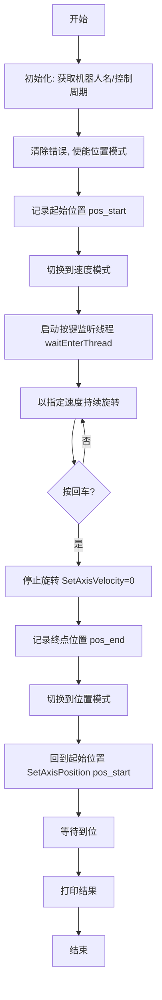

# ServoDemo.cpp 修改方案

## 需求分析

用户要求修改 [`system/HYYRobotX64GRIP/src/ServoDemo.cpp`](system/HYYRobotX64GRIP/src/ServoDemo.cpp)，实现以下功能：

1. **启动时记录当前位置** — 作为起始位置
2. **按照速度模式进行旋转** — 切换到速度模式，以指定速度持续旋转
3. **按回车时记录终点位置** — 用户按下回车键时，记录当前实际位置作为终点
4. **回到起始位置** — 记录终点后，切换回位置模式，将轴移动到起始位置

## 现有代码分析

当前 [`ServoDemo()`](system/HYYRobotX64GRIP/src/ServoDemo.cpp:15) 函数流程：
1. 初始化定时器、获取机器人名称和控制周期
2. 清除错误、使能位置模式（模式8）
3. 测试小位移并回到原点
4. 切换到速度模式（模式9）
5. 遍历多个预设速度值，每个速度运行3秒后停止
6. 按回车可提前结束测试

## 关键 API 参考

| API | 说明 |
|-----|------|
| [`GetAxisPosition(robot_name, axis_ID)`](system/robot_config/internal/include/DeviceDriver/device_interface.h:817) | 获取当前关节位置 (rad) |
| [`SetAxisPosition(robot_name, pos, axis_ID)`](system/robot_config/internal/include/DeviceDriver/device_interface.h:881) | 设置目标位置 (rad) |
| [`SetAxisVelocity(robot_name, vel, axis_ID)`](system/robot_config/internal/include/DeviceDriver/device_interface.h:891) | 设置目标速度 (rad/s) |
| [`set_axis_mode(robot_name, mode, axis_ID)`](system/robot_config/internal/include/DeviceDriver/device_interface.h:268) | 设置轴模式：8=位置模式，9=速度模式 |
| [`set_axis_control(robot_name, 0x000F, axis_ID)`](system/robot_config/internal/include/DeviceDriver/device_interface.h:278) | 设置控制字 |
| [`axis_power_on(robot_name, axis_ID)`](system/robot_config/internal/include/DeviceDriver/device_interface.h:231) | 轴上使能 |
| [`axis_reset_error(robot_name, axis_ID)`](system/robot_config/internal/include/DeviceDriver/device_interface.h:258) | 清除轴错误 |
| [`robot_ok()`](system/robot_config/internal/include/Base/RobotSystem.h:104) | 检查机器人状态是否正常 |
| [`getchar()`](system/HYYRobotX64GRIP/src/ServoDemo.cpp:10) | 阻塞等待按键输入 |

## 修改方案

### 整体流程



### 详细修改步骤

#### 1. 保留现有初始化代码（第17-35行）

保留定时器初始化、获取机器人名称、控制周期、清除错误、使能位置模式等代码。

#### 2. 记录起始位置（替换原第38行）

```cpp
double pos_start = GetAxisPosition(robot_name, axis_ID);
printf("起始位置: %.6f rad\n", pos_start);
```

#### 3. 切换到速度模式（保留原第50-55行）

```cpp
set_axis_mode(robot_name, 9, axis_ID);
sleep(1);
set_axis_control(robot_name, 0x000F, axis_ID);
sleep(1);
```

#### 4. 启动按键监听线程

使用已有的 `waitEnterThread` 和 `g_enter_pressed` 机制。在速度循环开始前启动线程。

#### 5. 速度模式旋转循环（替换原第63-101行）

```cpp
g_enter_pressed = 0;
pthread_t enter_thread;
pthread_create(&enter_thread, NULL, waitEnterThread, NULL);
pthread_detach(enter_thread);

double run_velocity = 1.0;  // 固定速度 rad/s
printf("速度模式旋转中，速度: %.3f rad/s\n", run_velocity);
printf("按回车记录终点位置并回到起始位置...\n");

while (!g_enter_pressed && robot_ok())
{
    userTimer(&timer);
    SetAxisVelocity(robot_name, run_velocity, axis_ID);
}

// 停止
SetAxisVelocity(robot_name, 0.0, axis_ID);
sleep(1);
```

#### 6. 记录终点位置并回到起始位置

```cpp
double pos_end = GetAxisPosition(robot_name, axis_ID);
printf("终点位置: %.6f rad\n", pos_end);
printf("移动距离: %.6f rad (%.2f deg)\n", 
       pos_end - pos_start, (pos_end - pos_start) * 180.0 / M_PI);

// 切换回位置模式
printf("切换回位置模式，回到起始位置...\n");
set_axis_mode(robot_name, 8, axis_ID);
sleep(1);
set_axis_control(robot_name, 0x000F, axis_ID);
sleep(1);

// 回到起始位置
SetAxisPosition(robot_name, pos_start, axis_ID);
sleep(2);  // 等待到位

// 验证
double pos_final = GetAxisPosition(robot_name, axis_ID);
printf("最终位置: %.6f rad, 偏差: %.6f rad\n", 
       pos_final, pos_final - pos_start);
```

### 完整修改后代码结构

```
ServoDemo()
├── 初始化 (timer, robot_name, td)
├── 清除错误，使能位置模式
├── 记录起始位置 pos_start
├── 切换到速度模式
├── 启动按键监听线程
├── while(!g_enter_pressed && robot_ok())
│   └── SetAxisVelocity(固定速度)
├── 停止旋转
├── 记录终点位置 pos_end
├── 切换回位置模式
├── SetAxisPosition(pos_start) 回到起始位置
├── 打印结果
└── 返回
```

### 注意事项

1. **线程安全**：`g_enter_pressed` 使用 `volatile` 修饰，适合作为简单标志位
2. **速度值选择**：建议使用 1.0 rad/s 作为默认速度，可根据需要调整
3. **到位等待**：使用 `sleep(2)` 等待位置模式到位，可根据实际响应时间调整
4. **错误处理**：保留 `robot_ok()` 检查，确保异常时能退出循环
5. **头文件**：需要包含 `<pthread.h>`（已有）
